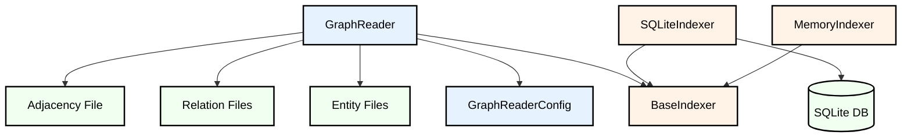

# Graph Reader

A Python library for reading and querying graph data stored in JSONL format. The library provides efficient access to entity and relation data with support for different indexing strategies.

## Features

- Efficient reading of graph data from JSONL files
- Support for multiple indexing strategies (SQLite and Memory)
- Entity caching for improved performance
- Adjacency list-based neighbor lookup
- Property-based entity search
- Configurable cache size

## Architecture

The library is organized into the following components:

### Core Components

- `GraphReader`: Main class for reading and querying graph data
- `GraphReaderConfig`: Configuration class for customizing reader behavior

### Indexers

The library supports multiple indexing strategies through a plugin architecture:

- `BaseIndexer`: Abstract base class for indexers
- `SQLiteIndexer`: SQLite-based indexing for persistent storage
- `MemoryIndexer`: In-memory indexing for faster access

### Data Structure

The library expects data to be organized in the following directory structure:

```
base_dir/
├── entities/
│   └── shard_*.jsonl
├── relations/
│   └── shard_*.jsonl
└── adjacency/
    └── adjacency.jsonl
```

### Architecture Diagram



## Installation

```bash
pip install graph-reader
```

## Usage

```python
from graph_reader import GraphReader, GraphReaderConfig

# Initialize the reader with configuration
config = GraphReaderConfig(
    base_dir="path/to/graph/data",
    indexer_type="sqlite",  # or "memory"
    cache_size=1000
)
reader = GraphReader(config)

# Get entity by ID
entity = reader.get_entity("entity_id")

# Get neighbors of an entity
neighbors = reader.get_neighbors("entity_id")

# Search entities by property
matching_entities = reader.search_by_property("property_key", "property_value")
```

## Configuration

The `GraphReaderConfig` class supports the following parameters:

- `base_dir`: Base directory containing the graph data
- `indexer_type`: Type of indexer to use ("sqlite" or "memory")
- `cache_size`: Maximum number of entities to cache in memory

## License

This project is licensed under the MIT License - see the LICENSE file for details.